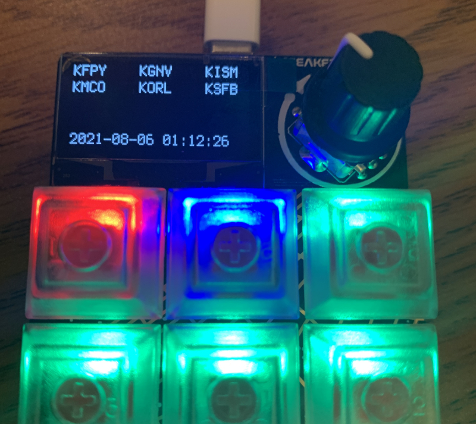
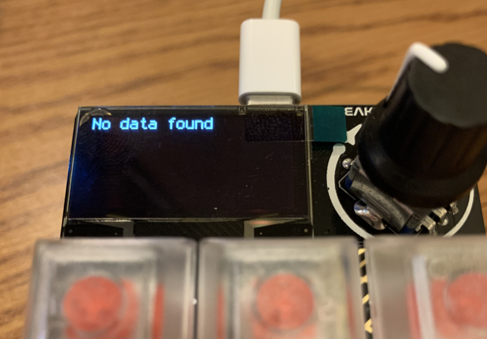

# metarpad
METAR Display for the Adafruit MacroPad. [Watch the demo!](https://youtu.be/nasEWtuSe3o)



## MacroPad

This project uses the [Adafruit MacroPad]() to display METAR and airport status. Follow their assembly and setup guide for CircuitPython and copy the required libraries to the board.

The code was written for CircuitPython 7.0, but you'll probably be ok with any modern version as long as your compiled libraries match the CircuitPython version you're using.

When you're ready, replace the `code.py` with the one from this project. When you see a message that no data could be found, you're ready to move to the next section.



## Driver

The [Adafruit MacroPad]() doesn't have any built-in ways to connect to the internet, but it does have a connection to your computer and performs a soft reset whenever files are updated on the CIRCUITPY drive. We can use this to our advantage to push data onto the device, but it requires us to run a separate program on our computer to do so. These are typically called "drivers."

Our `driver.py` uses the [AVWX]() library to pull and parse METARs for a list of up to 12 airport ICAO IDs. Edit the station list at the top of the file to change the airport data sent to the MacroPad. You can also change how frequently the driver updates the reports. By default, it will check every 15 minutes.

```python
STATIONS = ["KMCO", "KISM", "KORL", "KSFB"]

UPDATE_INTERVAL = 15 * 60  # 15 minutes
```

First, we need to install the [AVWX]() library. This assumes that `python` refers to a version of Python 3.7 or later. Always use a venv or some other environment manager instead of the system Python.

```bash
python -m pip install -r requirements.txt
```

The driver attempts to find the CIRCUITPY drive by looking for `code.py` in a couple of possible locations. These are listed in `SOURCES`. If the driver is having issues finding your drive, add the path to this list. Better yet, make a pull request or issue on this repo to share it. I could only test what I had available to me at the time.

Finally, run the driver to have it start sending data to your device. You should see the MacroPad refresh after a few seconds and display your new data.

```bash
python driver.py
```

[Adafruit MacroPad]: https://learn.adafruit.com/adafruit-macropad-rp2040 "Adafruit MacroPad Documentation"
[AVWX]: https://github.com/avwx-rest/avwx-engine "AVWX Python library on GitHub"
